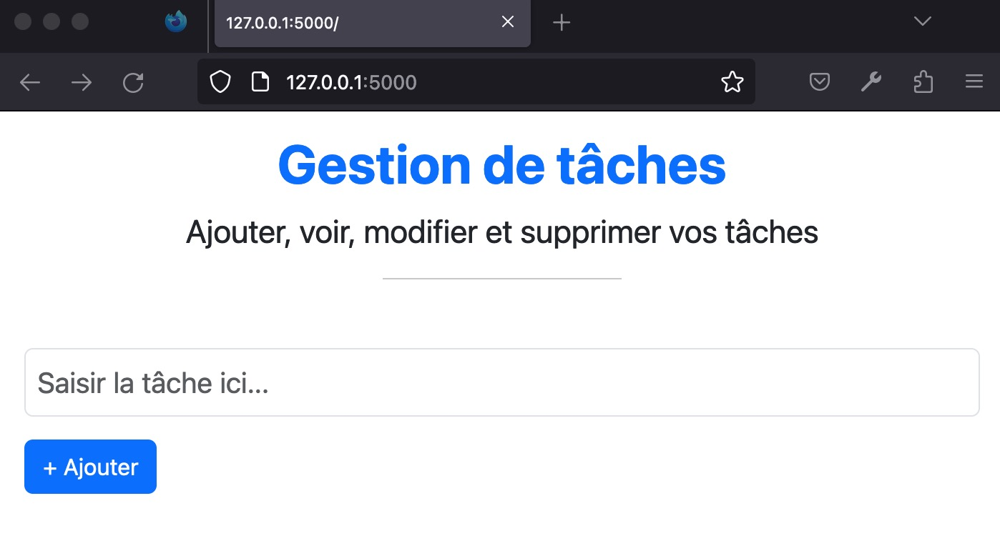
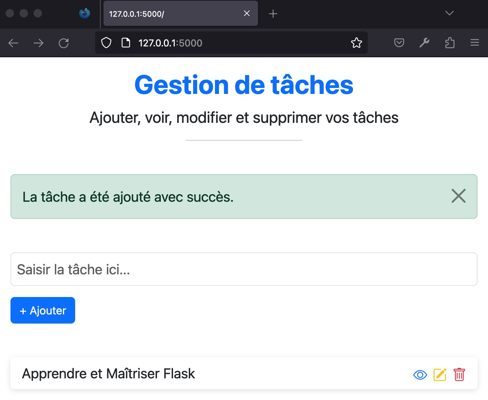
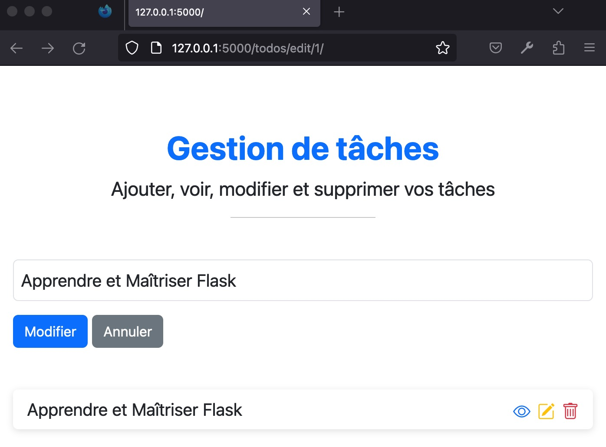
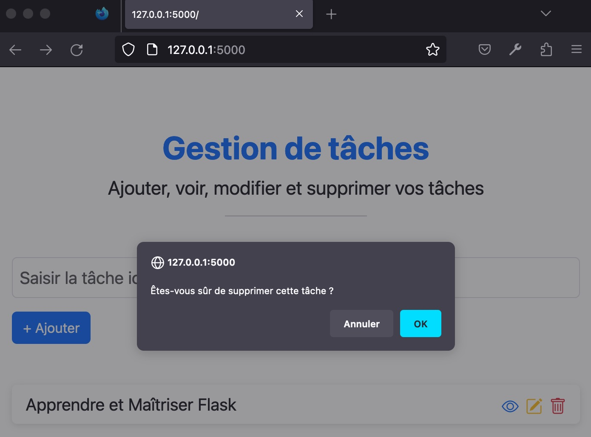

# GESTION DE TACHES

Une application  de gestion de tâches (TodoList) créée avec Flask et HTMX.

Pour réaliser cette petite application, vous aurez besoin de modules suivants:

- Flask: Bien entenu c'est avec Flask que l'application est codée;
- Flask-SQLALCHemy: Pour la gestion de la base de données;
- Bootstrap-Flask: Qui n'est pas obligatoire ici mais je l'ai utilisé pour mettre en place rapidement une UI;
- Et HTMX: que vous pouvez trouver [ici](https://htmx.org/).


Le fichier 'requirements.txt' décrit bien ces modules nécessaires.

```bash
pip3 install -r requirements.txt
```

Voici les captures d'écran de l'application:

<div style="display: grid; grid-template-columns: repeat(auto-fill,minmax(70px,1fr));
gap: 10px;
grid-auto-flow: dense;">








</div>
